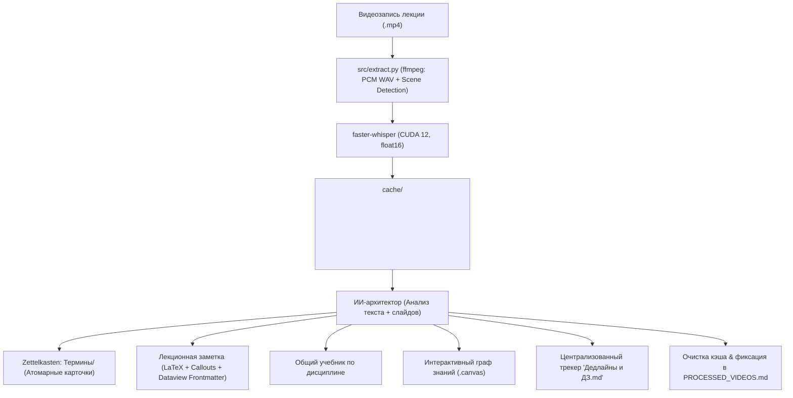

# 🎓 Obsidian Lecture Transcriber & Knowledge Base Automator

[](https://www.python.org/downloads/)
[](https://developer.nvidia.com/cuda-toolkit)
[](https://github.com/SYSTRAN/faster-whisper)
[](https://obsidian.md/)
[](LICENSE)

Автономный программный комплекс для **100% локальной (офлайн) транскрибации видеозаписей лекций и практик** с аппаратным ускорением на GPU (NVIDIA CUDA 12, cuDNN 9) и интеллектуальной интеграцией базы знаний в **Obsidian Vault**.

---

## 🌟 Ключевые возможности

- 🖥️ **Современный GUI (CustomTkinter):** удобное графическое приложение с поддержкой тёмной темы, выбором моделей Whisper (`tiny`, `base`, `small`, `medium`, `large-v3`), переключением GPU (CUDA float16) / CPU (int8) и прогресс-баром.
- ⚡ **Аппаратное ускорение транскрибации:** движок `faster-whisper` на базе CTranslate2 обеспечивает расшифровку аудио в 4–8 раз быстрее реального времени на видеокартах NVIDIA GeForce RTX.
- 👁️ **Умная детекция слайдов (Scene Change Detection):** адаптивная нарезка ключевых кадров видеоряда через фильтры `ffmpeg` — извлекаются только реальные смены слайдов презентации (в среднем 15–25 кадров на пару вместо сотен дублей).
- 🧠 **Сквозная интеграция с Obsidian Vault:**
  - **Zettelkasten-понятия:** автоматическое пополнение атомарных определений в папке `Термины/`.
  - **Академический KaTeX LaTeX:** формулы, выкладки и теоремы форматируются в чистый LaTeX (`$$...$$`).
  - **Генеральные учебники:** консолидация материала в единый `Учебник - <Дисциплина>.md` с логической структурой по главам.
  - **Интерактивные холсты (`.canvas`):** построение и автоматическое обновление графов знаний (синие узлы лекций, зелёные узлы понятий в групповых фреймах).
  - **Трекер дедлайнов и ДЗ:** фиксация контрольных точек и домашних заданий в централизованном файле `Дедлайны и ДЗ.md`.
  - **Active Recall:** блок вопросов для экзамена и самопроверки с ответами под спойлерами в конце каждой лекции.
- 🏷️ **Стандарт аббревиатур дисциплин:** единая номенклатура файлов (`АДиИИ`, `АГиТДУ`, `ДМ`, `ИнЯз`, `ИТиС`, `МатАн`, `ОПД`, `ОРГ`, `ПФК`, `ПРОГ`) с защитой от битых ссылок (Zero Broken Links Protocol).

---

## 🏗️ Архитектура конвейера (Pipeline)



---

## 📁 Структура проекта

```text
├── src/
│   └── extract.py                  # Основной движок извлечения аудио, транскрибации и нарезки кадров
├── docs/
│   └── architecture/
│       ├── pipeline.md             # Спецификация конвейера автономной обработки
│       └── obsidian_vault.md       # Спецификация структуры базы Obsidian Vault
├── tests/
│   └── test_smoke.py               # Комплексный сьют дымовых тестов (верификация целостности)
├── app_gui.py                      # Десктопный GUI на CustomTkinter
├── Запустить_Транскрибатор.bat      # Быстрый запуск GUI для Windows в один клик
├── AGENTS.md                       # Мастер-контракт разработки и регламент ИИ-агентов (стандарт 2026)
├── GEMINI.md                       # Обратная совместимость и навигация по правилам
├── PROCESSED_VIDEOS.md             # Реестр обработанных видео и статистика по предметам
├── repomix-output.xml              # AST-карта репозитория для мгновенного контекста агентов
├── .env.example                    # Пример конфигурации путей и параметров модели
└── .gitignore                      # Исключения кэшей, медиафайлов и виртуального окружения
```

---

## 🚀 Быстрый старт

### Системные требования
- **ОС:** Windows 10/11 (64-bit)
- **Python:** 3.12 или выше
- **Пакетный менеджер:** [uv](https://github.com/astral-sh/uv) (рекомендуется)
- **FFmpeg:** системный бинарник `ffmpeg` в системном `PATH`
- **GPU (опционально, для ускорения):** видеокарта NVIDIA с поддержкой CUDA 12 и cuDNN 9

### 1. Клонирование репозитория
```bash
git clone https://github.com/Gupkagrop/recording.git
cd recording
```

### 2. Установка зависимостей через `uv`
```powershell
uv venv
uv pip install -r requirements.txt
# или установка ключевых пакетов:
uv pip install faster-whisper ffmpeg-python customtkinter pillow
```

### 3. Настройка переменных окружения
Скопируйте пример конфигурации и укажите путь к вашему хранилищу Obsidian:
```powershell
copy .env.example .env
```

---

## 💻 Использование

### Вариант А: Графический интерфейс (GUI)
Просто запустите батник двойным кликом:
```powershell
.\Запустить_Транскрибатор.bat
```
Или через терминал:
```powershell
uv run python app_gui.py
```
1. Выберите видеофайл (`.mp4`, `.mkv`, `.avi`, `.mov`).
2. Выберите модель Whisper (`small` оптимальна по соотношению скорости и качества).
3. Нажмите **«Начать транскрибацию»**.

### Вариант Б: Консольный запуск (CLI)
```powershell
uv run python src/extract.py "C:\Users\...\Videos\Математика. Лекция 1.mp4"
```
Результаты (аудиодорожка `audio.wav`, полный транскрипт с таймкодами `transcript.txt` и опорные кадры слайдов в `frames/`) будут сохранены в папку `cache/<video_basename>/`.

---

## 🧪 Тестирование и верификация

Запуск полного сьюта автоматических проверок целостности:
```powershell
uv run python -m unittest tests/test_smoke.py
```
Синтаксическая компиляция:
```powershell
uv run python -m py_compile src/extract.py app_gui.py tests/test_smoke.py
```
Сборка AST-карты кодовой базы:
```powershell
npx repomix --style xml
```

---

## 📄 Лицензия

Проект распространяется под свободной лицензией **MIT**. Подробности в файле [LICENSE](LICENSE).
