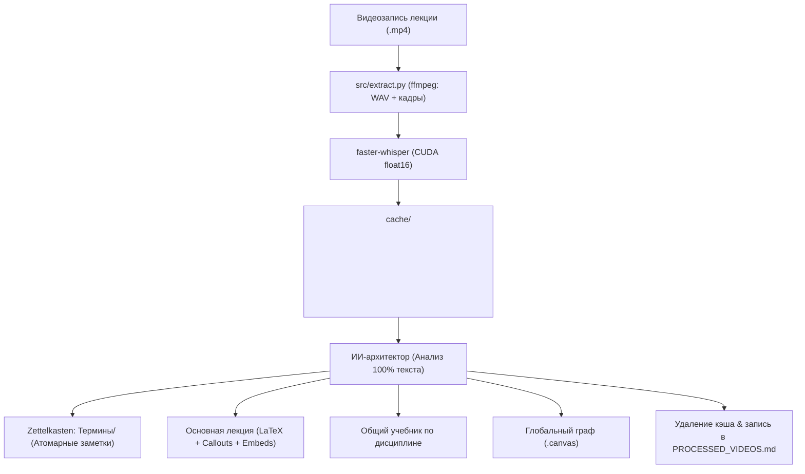

> [!NOTE]
> Архитектурная спецификация сквозного конвейера автономной обработки видеозаписей лекций и синхронизации с базой знаний Obsidian.

# Конвейер автономной обработки лекций (Pipeline Architecture)

## 1. Общий поток данных (End-to-End Workflow)



## 2. Этапы конвейера

### Шаг 0. Верификация контекста, дисциплины и расписания
- Агент обязан предварительно просканировать существующую структуру Obsidian Vault для исключения дубликатов и коллизий имён.
- **Сверка с `Расписание.md`:** Агент сверяет дату видеозаписи со сводной заметкой `Расписание.md` в корне Vault, определяя чётность недели, порядковый номер пары и тип занятия (лекция или практика).
- **Математические дисциплины:** При наличии математического аппарата (формулы, доказательства) агент обязан уточнить точное наименование курса (Алгебра, Матанализ, Дискретная математика).

### Шаг 1. Локальное извлечение аудио и кадров
- Выполняется команда:
  ```powershell
  uv run python src/extract.py "<video_path>"
  ```
- Аудио извлекается через `ffmpeg` в 16-битный PCM WAV (моно, 16 кГц).
- Транскрибация выполняется через `faster-whisper` на графическом процессоре (`device="cuda"`, `compute_type="float16"`).
- Ключевые кадры нарезаются умным детектором смены сцен (Scene Change Detection).

### Шаг 2. Анализ транскрипта, мультимодальный анализ слайдов и переименование
- Прочитывается 100% файла транскрипта (`transcript.txt`). Частичное чтение запрещено.
- **Обязательный визуальный анализ кадров (Multimodal Inspection):** Агент ОБЯЗАН просматривать видеокадры и слайды презентации из папки `cache/<video_basename>/frames/` через инструмент `view_file`. На слайдах и доске содержится самая плотная и безошибочная информация (точные формулы, теоремы, определения, структуры данных, листинги кода), которую преподаватель часто не проговаривает целиком. Агент сопоставляет временные метки транскрипта с номерами кадров (1 кадр в минуту) и считывает с них визуальный контент.
- **Переименование видеофайла:** Если исходный файл имеет неинформативное имя (например, `2026-09-14 10-37-07.mp4`), после установления темы и предмета файл переименовывается в осмысленное имя (например, `Основы проектной деятельности. Лекция 1.mp4`).

### Шаг 3. Извлечение концептов (Zettelkasten)
- Выделение только явно сформулированных определений (как из речи, так и со слайдов презентации).
- Создание файлов в `<Subject>/Термины/<Термин>.md` с YAML-фронтматтером.
- При повторном упоминании термин дополняется, а не перезаписывается.

### Шаг 4. Формирование основной заметки лекции
- **Именование файла с аббревиатурой:** Имя заметки ОБЯЗАТЕЛЬНО начинается с официальной аббревиатуры предмета: `<АББРЕВИАТУРА> - Лекция <N>. <Тема>.md` или `<АББРЕВИАТУРА> - Практика <N>.md` (список см. в [obsidian_vault.md](file:///C:/Users/denis/Documents/antigravity/recording/docs/architecture/obsidian_vault.md)).
- **Стандартный YAML Frontmatter:** Заметка снабжается шапкой для Dataview (`subject`, `type`, `number`, `date`, `week`, `tags`).
- **Блок самопроверки (Active Recall):** В конце заметки формируется раздел `## ❓ Вопросы для экзамена и самопроверки` со скрытыми ответами-спойлерами `> [!question]- Ответ`.
- **Фиксация домашних заданий и дедлайнов (Изолированный реестр):** При озвучивании преподавателем ДЗ, требований к лабораторным работам или контрольным точкам агент обязан зафиксировать задачу в `Obsidian Vault/Дедлайны и ДЗ.md`. **Строгий запрет wiki-ссылок `[[...]]`:** в самих заметках пар **ЗАПРЕЩЕНО** ставить ссылки на `[[Дедлайны и ДЗ]]`, а в файле `Дедлайны и ДЗ.md` **ЗАПРЕЩЕНО** ставить ссылки `[[...]]` на пары. Занятие-источник указывается исключительно обычным текстом (например: `Источник: ПРОГ - Лекция 2. Базовый синтаксис`). Это полностью изолирует файл дедлайнов от графа связей Obsidian.

- **Миграция старых заметок (Migration Protocol):** При первой встрече с дисциплиной агент обязан аккуратно переименовать ранее созданные заметки без аббревиатуры под новый стандарт, СТРОГО обновив все входящие ссылки `[[...]]` в терминах, учебниках, холстах Canvas и реестре `PROCESSED_VIDEOS.md` без потери связей.
- **Запрет встраивания "сырых" картинок:** Запрещено вставлять скриншоты как графические файлы (`![[frame.jpg]]`), чтобы не раздувать хранилище. Вместо этого весь визуальный материал со слайдов переводится в чистый KaTeX LaTeX (`$$...$$`), Mermaid-схемы и markdown-таблицы.
- Использование семантических коллаутов Obsidian (`[!note]`, `[!info]`, `[!warning]`, `[!example]-`).
- Встраивание определений через блок-трансклюзии: `![[Термин]]`.

### Шаг 5. Агрегация в генеральный учебник
- Интеграция нового материала в монолитный файл `Учебник - <Subject>.md` с делением по логическим главам, а не хронологическим парам.

### Шаг 6. Обновление интерактивного холста (Canvas)
- Обновление графа `<Subject>.canvas`.
- Узлы лекций — цвет `5` (синий), узлы терминов — цвет `4` (зелёный).
- Группировка терминов в визуальный узел `group` («Термины / Concepts»).

### Шаг 7. Самопроверка связей (Self-Linting), очистка кэша и реестр
- **Автоматический аудит ссылок (Self-Linting):** Агент обязан проверить созданные и обновлённые заметки на предмет битых ссылок вида `[[...]]`. Все ссылки обязаны указывать на существующие файлы.
- **Удаление временных утилит:** Все одноразовые скрипты, созданные в процессе работы, должны сохраняться исключительно в `scratch/` и удаляться по завершении задачи. Запрещено оставлять файлы в корне проекта.
- **Очистка кэша:** Удаление директории `cache/<video_name>/`.
- **Обновление реестра:** Добавление записи в [PROCESSED_VIDEOS.md](file:///C:/Users/denis/Documents/antigravity/recording/PROCESSED_VIDEOS.md).
