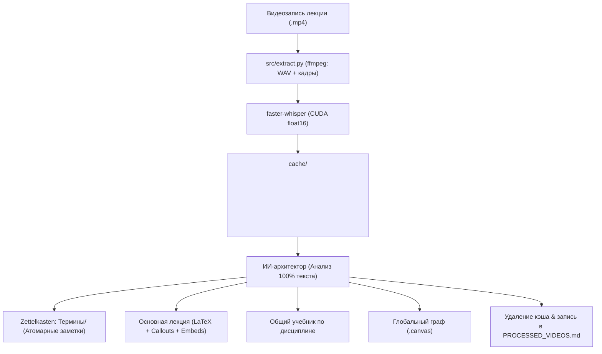

> [!NOTE]
> Архитектурная спецификация сквозного конвейера автономной обработки видеозаписей лекций и синхронизации с базой знаний Obsidian.

# Конвейер автономной обработки лекций (Pipeline Architecture)

## 1. Общий поток данных (End-to-End Workflow)



## 2. Этапы конвейера

### Шаг 0. Верификация контекста и дисциплины
- Агент обязан предварительно просканировать существующую структуру Obsidian Vault для исключения дубликатов и коллизий имён.
- **Математические дисциплины:** При наличии математического аппарата (формулы, доказательства) агент обязан уточнить точное наименование курса (Алгебра, Матанализ, Дискретная математика).

### Шаг 1. Локальное извлечение аудио и кадров
- Выполняется команда:
  ```powershell
  uv run python src/extract.py "<video_path>"
  ```
- Аудио извлекается через `ffmpeg` в 16-битный PCM WAV (моно, 16 кГц).
- Транскрибация выполняется через `faster-whisper` на графическом процессоре (`device="cuda"`, `compute_type="float16"`).

### Шаг 2. Анализ транскрипта и переименование видео
- Прочитывается 100% файла транскрипта. Частичное чтение запрещено.
- **Переименование видеофайла:** Если исходный файл имеет неинформативное имя (например, `2026-09-14 10-37-07.mp4`), после установления темы и предмета файл переименовывается в осмысленное имя (например, `Основы проектной деятельности. Лекция 1.mp4`).

### Шаг 3. Извлечение концептов (Zettelkasten)
- Выделение только явно сформулированных определений.
- Создание файлов в `<Subject>/Термины/<Термин>.md` с YAML-фронтматтером.
- При повторном упоминании термин дополняется, а не перезаписывается.

### Шаг 4. Формирование основной заметки лекции
- Никаких скриншотов с текстом: все формулы и выкладки переводятся в чистый LaTeX (`$$...$$`).
- Использование семантических коллаутов Obsidian (`[!note]`, `[!info]`, `[!warning]`, `[!example]-`).
- Встраивание определений через блок-трансклюзии: `![[Термин]]`.

### Шаг 5. Агрегация в генеральный учебник
- Интеграция нового материала в монолитный файл `Учебник - <Subject>.md` с делением по логическим главам, а не хронологическим парам.

### Шаг 6. Обновление интерактивного холста (Canvas)
- Обновление графа `<Subject>.canvas`.
- Узлы лекций — цвет `5` (синий), узлы терминов — цвет `4` (зелёный).
- Группировка терминов в визуальный узел `group` («Термины / Concepts»).

### Шаг 7. Очистка кэша и реестр
- Удаление директории `cache/<video_name>/`.
- Добавление записи в [PROCESSED_VIDEOS.md](file:///C:/Users/denis/Documents/antigravity/recording/PROCESSED_VIDEOS.md).
